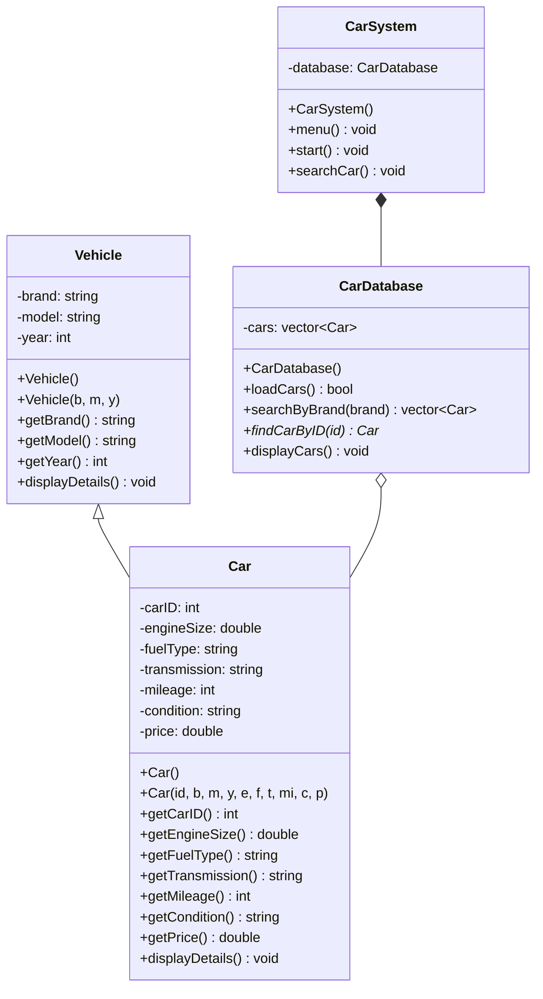

# CS121-Final-Project- 
## UML Diagram

```mermaid
classDiagram

    class Vehicle {
        -brand: string
        -model: string
        -year: int
        +Vehicle()
        +Vehicle(b, m, y)
        +getBrand() string
        +getModel() string
        +getYear() int
        +displayDetails() void
    }

    class Car {
        -carID: int
        -engineSize: double
        -fuelType: string
        -transmission: string
        -mileage: int
        -condition: string
        -price: double
        +Car()
        +Car(id, b, m, y, e, f, t, mi, c, p)
        +getCarID() int
        +getEngineSize() double
        +getFuelType() string
        +getTransmission() string
        +getMileage() int
        +getCondition() string
        +getPrice() double
        +displayDetails() void
    }

    class CarDatabase {
        -cars: vector~Car~
        +CarDatabase()
        +loadCars() bool
        +searchByBrand(brand) vector~Car~
        +findCarByID(id) Car*
        +displayCars() void
    }

    class CarSystem {
        -database: CarDatabase
        +CarSystem()
        +menu() void
        +start() void
        +searchCar() void
    }

    Vehicle <|-- Car
    CarDatabase o-- Car
    CarSystem *-- CarDatabase
```
